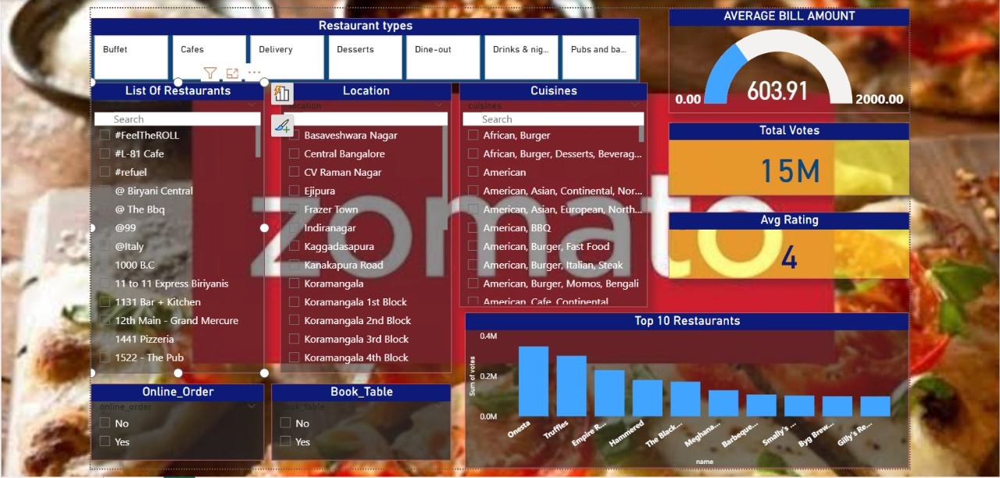

# 🍽️ Zomato Sales Performance Dashboard

A data analysis dashboard project created using **Power BI** and **Excel**, focused on Zomato's regional sales insights, top-selling items, delivery efficiency, and customer behavior.

## 📊 Project Overview

This dashboard helps visualize Zomato's monthly sales performance with the following goals:
- Track total revenue, order count, and average order value
- Compare performance across cities and food categories
- Monitor peak order times and delivery patterns

## 🛠 Tools Used

- **Power BI** – Data modeling and visualization
- **Microsoft Excel** – Data cleaning and preprocessing

## 📁 Files in This Repository

- `SalesDashboard.pbix` – The Power BI dashboard file
- `SalesData.xlsx` – The raw and cleaned Excel data
- `Dashboard_Screenshot.png` – Visual preview of the dashboard

## 🔍 Key Insights

- 🚀 Top Cities: Bangalore & Mumbai lead in revenue
- 🍕 Best Sellers: Biryani and Pizza
- ⏰ Peak Times: Dinner hours and weekends
- ⛟ Delivery: 90% of deliveries are under 35 mins

## 📸 Dashboard Preview

![Zomato Sales Dashboard](# 🍽️ Zomato Sales Performance Dashboard

A data analysis dashboard project created using **Power BI** and **Excel**, focused on Zomato's regional sales insights, top-selling items, delivery efficiency, and customer behavior.

## 📊 Project Overview

This dashboard helps visualize Zomato's monthly sales performance with the following goals:
- Track total revenue, order count, and average order value
- Compare performance across cities and food categories
- Monitor peak order times and delivery patterns

## 🛠 Tools Used

- **Power BI** – Data modeling and visualization
- **Microsoft Excel** – Data cleaning and preprocessing
- **DAX & Power Query** – Metrics and calculations

## 📁 Files in This Repository

- `SalesDashboard.pbix` – The Power BI dashboard file
- `SalesData.xlsx` – The raw and cleaned Excel data
- `Dashboard_Screenshot.png` – Visual preview of the dashboard

## 🔍 Key Insights

- 🚀 Top Cities: Bangalore & Mumbai lead in revenue
- 🍕 Best Sellers: Biryani and Pizza
- ⏰ Peak Times: Dinner hours and weekends
- ⛟ Delivery: 90% of deliveries are under 35 mins

## 📸 Dashboard Preview

**Rishitha M**  
🔗 [LinkedIn Profile](http://www.linkedin.com/in/rishitha-m)  
📧 rishitha.m2022cse@sece.ac.in

